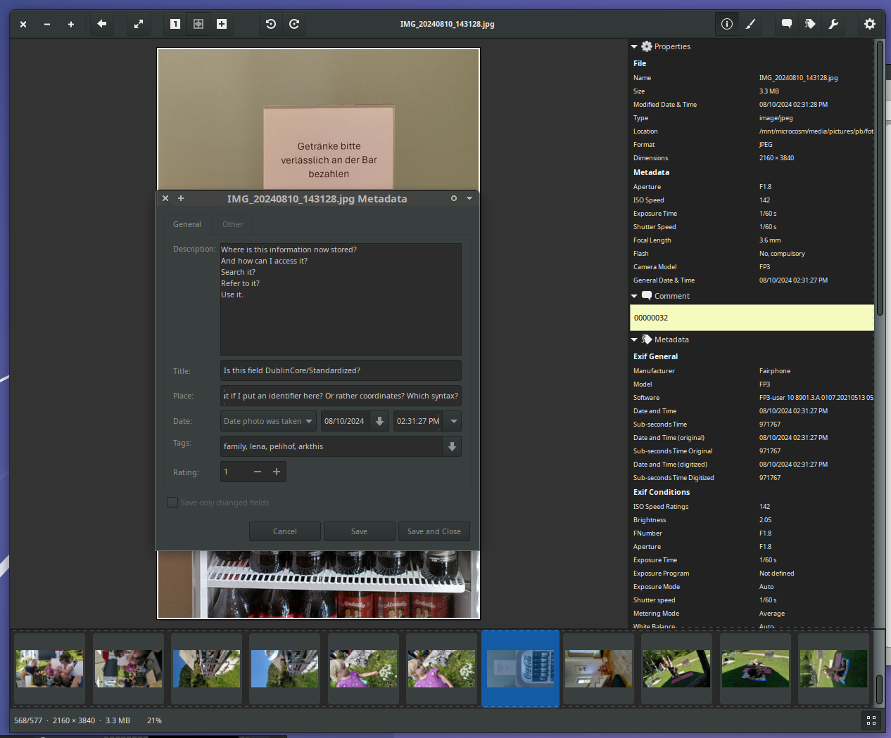
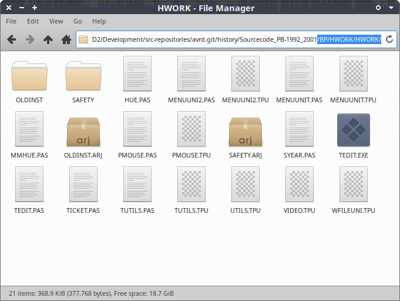
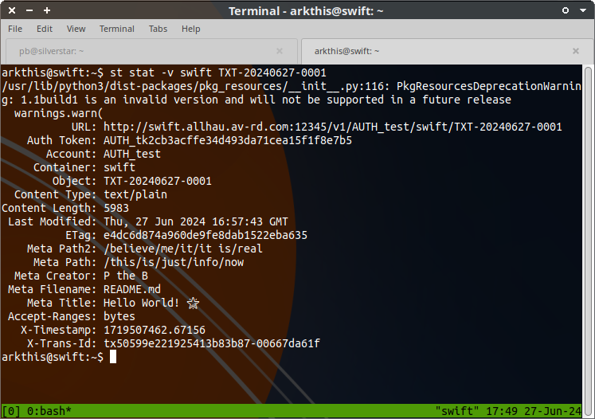
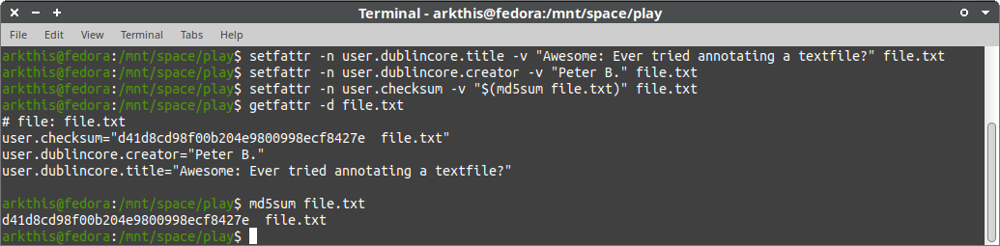
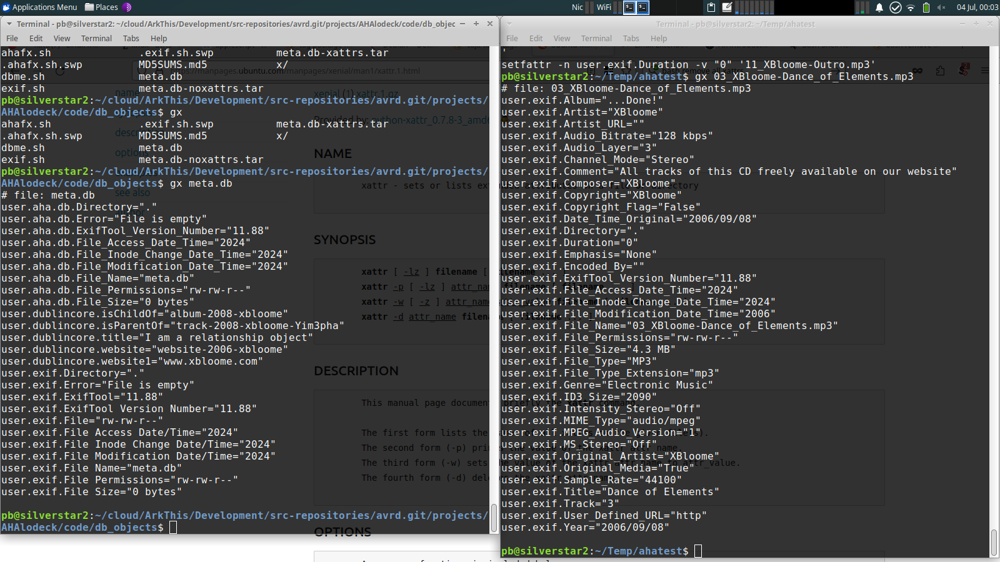
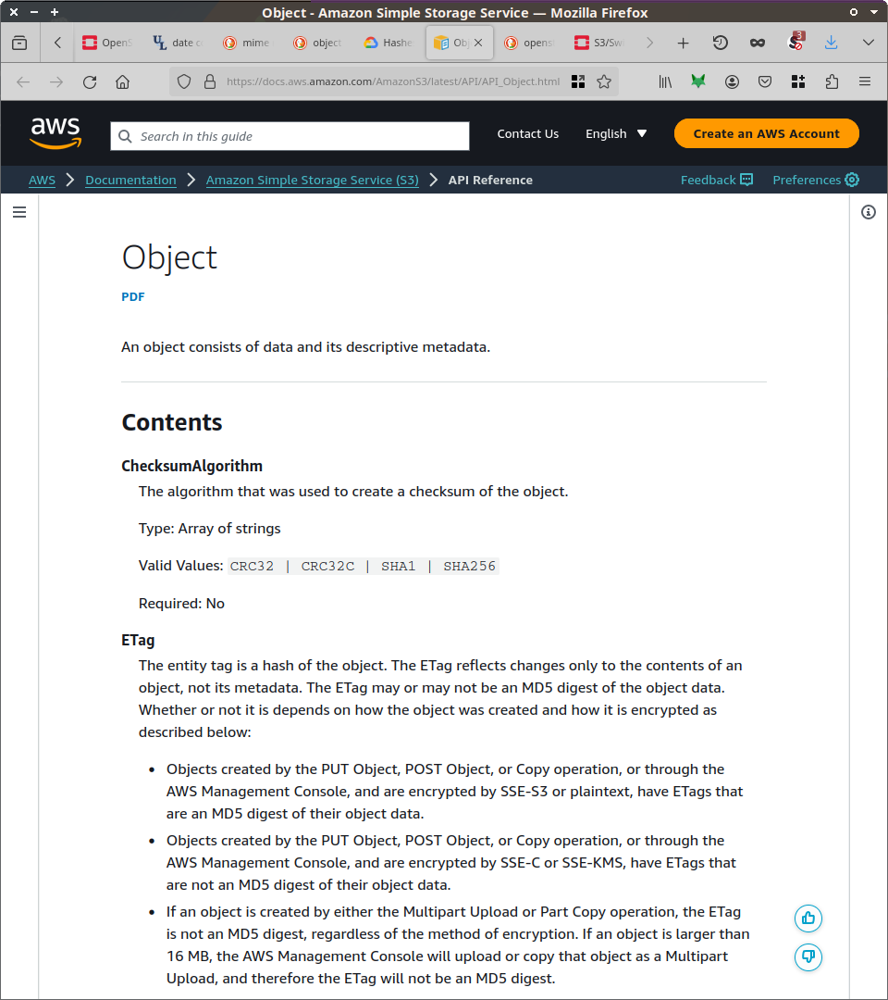
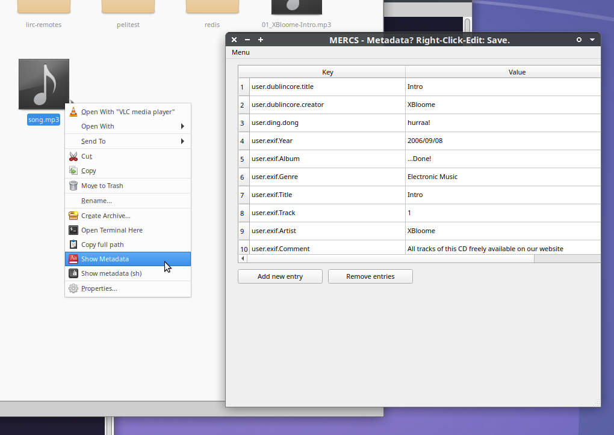

(this is a ~7min. read)

# Project Plans

  * Solving GLAM daily issues by shifting to a modern (big data) tech-stack and filesystems.
  * 3y funded project.
  * 3 software developers
  * 2 dev-ops/sysadmin
  * 1 mastermind with a roadmap for a useful working prototype

## Outcome:

  * User Interface (UI) tools for catalogue needs on filesystem-level.
  * Practically approved suggestions for meta+data structuring with Data Lake Object capabilities.
  * Tutorials, presets, profiles, etc - for common use-cases of data collection handling: using filesystem as DB.
  * Blueprint for professional GLAM storage (network).

## Addresses the following issues

  * spreadsheets for collection/data annotation.
  * file-format specific, embedded metadata.
  * store/query/retrieval of any digital information.
  * interoperability, migration, updates, obsolescence.

-------------------------------------

# Store "Meta" where the "Data" is: In the filesystem.

> Which has already been tried and done in the mid-90s, and was basically forgotten, overlooked.
> Because it wasn't really well-enough-supported, and tags got lost - and therefore trust.
>
> So why drag in a dead cat?

Why didn't these extended-attributes become more popular?
Possibly due to sufficient use of existing metadata "workarounds" and hardware performance/memory limitations back then (~1995-2005).
Hardware limitations and prices have greatly changed since then, making new meta+data storage and handling implementations now easily possible.

Therefore I propose revisiting the possibilities provided by having `meta+data` in the filesystem as the new default.

|  |
|:--:|
| Screenshot: A typical image collection tool: **Where and how is metadata currently stored?** How well does it travel? |

# A Holodeck by August: Resolving annoying daily GLAM issues for good, by switching to a Big Data tech-stack and using filesystems for annotation needs.

(**GLAM**: Galleries, Libraries, Archives and Museums)

Until 1995, a filename (in DOS) may only consist of:

  * Uppercase-ASCII characters only (no SPACE)
  * maximum 8 characters as file/foldername
  * and 3 for the filetype.
  * only 1 dot.

Imagine how much all users and developers have been empowered simply by "allowing" long filenames on popular filesystems?

|  |
|:--:|
| Screenshot of a real world "8.3" filename example |

> **The usage of different data-handling paradigms, proposed in this document, may be comparable to allowing 250+ characters in 1995. No more need for a spreadsheet or database for most daily needs: Simply right-click-edit-metadata.**

Now hardly anyone remembers that "long filenames" have not always been around.

Technologies have evolved, which allow completely different ways of data-handling.

There exist technologies developed since 2001, originally intended for proper meta+data handling - instead of relying on file/foldernames - and later "Big Data" processing and scaling demands: These tools and setups provide generic "processing workflows" that scale out by hardware - not manpower.

The current situation for *any* digital data collection is problematic, and stuck in a neverending migration of data and tools: **The reason is that the files-in-folders paradigm is at its end.**

This is where "Big Data" comes to play:  

They have realized the "files-in-folders paradigm limits", and provided working options for making a folder structure optional - and storing "Files" as Objects (with Metadata).
Each Object has a technical identifier - and an arbitrary number of key/value data with it.

Access (search and retrieval) for usage is done by querying indexers that have cached the filesystem data. Merely for fast(er) access. This allows real-time typing-suggestions, etc.

> **Being able to store and access (for use) any "file content" as kind of "Data Object" is like introducing long filenames back then:**  
Giving the average user (and any developer) the option to "simply" provide right-click-edit-metadata capabilities.

And simply ask for "keywords/tags" or provide "filename/foldername" as 2 metadata fields when "saving your work".
Imagine handling your files like your browser bookmarks: "save" - then use tags and fulltext search.

This already works out of the box on POSIX systems (since 2003).

## Common storage configuration and network

The storage design proposed for this project, allows a blueprint "Linux Package" to install and setup a GLAM-Object Storage Node in less than 30 minutes. An easy and well-known-procedure, like setting up a Linux Webserver after 2000.

This storage may be accessed by Windows/MacOS machines, too.

This will allow to have common hardware/software/config setups for storing data professionally.
And interconnect those storages (if intended) to a storage-network of this kind.

Because it is based on Cloud-Stack components, and therefore scales identically.
It also allows to access metadata or data in the same way (programatically as well as common stable user-interfaces) - and at comparable performance, even on lower-end or simply older hardware.

|  |
|:--:|
| Screenshot: Proof-of-Concept meta+data tests with OpenStack Swift. A large scale cloud computing Object Store Cloud component, running on local hardware (Docker) |

## The outcome of this project

Will be to orchestrate existing technologies, mainly borrowed from Big Data and Open Standards environments applied to resolve daily GLAM tasks in more of a flow.

> Resulting in a basic software environment that allows curating digital collections in a new computing paradigm: reducing interoperability issues and migration efforts (costs).

This new computing paradigm is basically comparable to what online-service providers are using large-scale productively since around 2005. The design of this project covers what cloud providers currently offer as basic functionality - and adds professional GLAM/Science annotation and semantic data and standards.

By adding our GLAM experience in handling all kinds of data under all kinds of "epochs" to the current change of digital data-handling usage, we can introduce proper asset-management means based on "filesystem LEGO blocks".

Annotating becoming as basic as "put it in the filename".
Now without the need to choose a folder,
And with the basic option to "add keyword".
And fulltext search and filter options by default.

That'd be it.
For now.

# Cloud features everwhere: even local.

There are certain search/find/annotate/relate features that basic Cloud storage providers offer users already: Tag your images, link to something, search/query/filter - instead of "walking directory paths".

Just hit "save" - and it's going to be "stored somewhere".
All you need to provide is something you remember to find it again.

> **The reason why online Cloud services can provide these features is that they are based (internally) on a completely different technology stack than even the most professional "state of the art conventional database+filesystem" applications.**

Since professional "Big Data" Cloud tech-stacks are now available as paid-support FOSS, such a feature set can now easily be deployed locally too. From a single-disk-single-host to an on-premis storage cluster - and if desired, possibly connected to a geo-replicated Memory-Institution Storage Cloud.

And you get all the tag/search/find Data Object features for your local, offline works too.

# What is different about this approach?

There are still many (valid) reasons why everyone of us still puts "more information than they should" into a filename. And coming up with good-and-lasting folder (naming) structures is another quest on its own.

That we all "love filenames" as go-to metadata field is still very common.

This is IMO proof that the common filesystem is still the one "safe" option that *anyone* can easily access, view, edit - and somewhat understand.

> "There is a file with that name in that folder ..."

This is where all users and programmers meet.

## Using the Filesystem as Database - and the OS as interface

|  |
|:--:|
| Screenshot: metadata in extended file attributes (commandline, Linux). |

Now it gets a bit trickier:

> "And the information about my file/song/image/... is somewhere else."

> "...or burried inside. Usually binary. Can you read hex?"

|  |
|:--:|
| Screenshot: LEFT= 0-byte file acting as a working database entry. RIGHT= MP3 metadata stored as filesystem attributes (plaintext, auto-extracted using `exiftool`) |

Dealing with related meta+data can be handled differently already:

**On a Linux setup from 2020, storing metadata (key/value) information with files-and-folders works out of the box.**

Using common tools, common libraries and common filesystems (ext4, zfs), having persistent meta+data even when copying over a network and back.

Linux and MacOS supports and uses these extended file attribute (xattr) features themselves for more than 20 years - so we can consider this technology stable.

Using xattrs allows moving gradually from conventional "files-in-folders" storages onto Object Storage systems.

## Online cloud already does it.

|  |
|:--:|
| Amazon's public definition of Data Objects on their storage |
 

When asking younger users, how they deal with search/using/sorting their files - their answer is often:

> "I do not have any files. I have my data in the cloud."

And there they simply use a search-box and tags or links - fulltext search and filtering by default.

Due to the lack of comparable "basic" features "offline", many turn to rather having most of their data (private and professional) on some (cheap/free/professional) online cloud provider networks.

This project plan includes means for bridging this gap, and having seamless filesystem-level interoperability of related-data-objects. Any format, any size, any number.

Cloud features online and offline.
In any application that can access a proper filesystem.

## Having Meta-with-Data as basic option

Existing common filesystems have the ability to store metadata with files/folders since ~2003.
This would cover the following use-cases out-of-the-box by the operating system and basic tools:

  * annotate any key-value information regardless of file format.
  * thereby replacing the need for embedding metadata.
  * created related objects, by adding links by metadata key-values.
  * replace most spreadsheet for annotation cases.
  * replace most basic database (filemaker, access) cases.

This is not yet-another-asset-management-system with its own database and environment: This is an orchestration of existing tools and existing serious system-standards - using Big Data tech-stack components, documentation and support. Resulting in a working-blueprint prototype that provides a proper environment for handling of Data Objects - in the most interoperable and LEGO-like way.

It is merely like the step from 8.3 to 250+ characters - and Unicode later:
Having Meta-with-Data anywhere. Right-Click-Edit-Metadata. Just like that.

And maybe in 10 years noone will remember it has ever been different? :P

This `meta+data` feature alone - and UIs and presets to work with it, may be implemented in a fraction of the time currently required to fund *a single* metadata-catalog-online-web-standard meta+data migration project. The provided outcome is comparable to using basic GNU/FOSS commandline and GUI tools and standards consistently - for decades and counting.

|  |
|:--:|
| Screenshot: **Right Click Edit Metadata** -  Proof-of-Concept Python FS-Metadata GUI (xattr). \newline The metadata shown in the grid is read from the filesystem. NOT the mp3 (Plus: Note the mix of tag-keys) |

# Software components

The key components this project will focus/base on, are:

  * Metadata capabilities of filesystem/OS (key-value store)
  * Object storage (as successor of files-in-folders)
  * Data Lake(house) handling
  * Search/Filter caching & indexing
  * External, common (standard) lists for controlled vocabulary/facets.

Leading to:

  * A generic set of building blocks and tools to work with arbitrary digital collections.
  * A resolution of most interoperability issues (file-formats, metadata-layouts, interfaces, databases, etc) natively by the differnt new paradigm-properties.
  * The ability to (re)use these new basic data-handling options anywhere (Standards: POSIX (xattr), Object Store (ANSI T10), etc).

**Most software components required for a production-useful prototype already exists.**

So it will be possible to cover many daily use-cases within GLAM (and even personal to professional tasks where one would now normally use/require a DAM/DB or Spreadsheet application for the same functionality).

Currently missing components are:

  * (graphical) user interfaces for general key/value filesystem metadata handling.
  * presets and templates for daily tasks.
  * a proper storage layout and configuration to support professional meta+data handling.
  * proper ongoing paid support.

This is great work for remote+local mixed-size IT suppliers:
As it is doable to support a common, stable stack.

## Known issues / FAQs

Common questions are:

  * Performance?
  * Scalability?
  * Hard/easy/auto to setup?
  * Stable?
  * Reliable? Gets lost on copy/zip/convert?
  * Compatible with...?

# Once in the Data Object World and tools, there is way more to explore...

Seriously, this goes into resolving file-formats into related Data Object Graphs, etc...  
But that is another story :)
